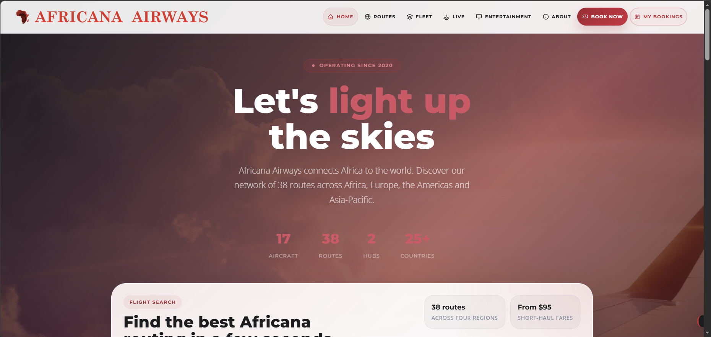
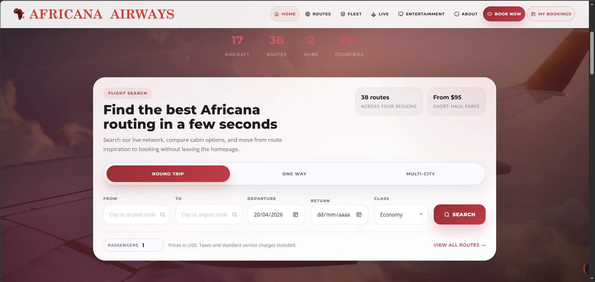
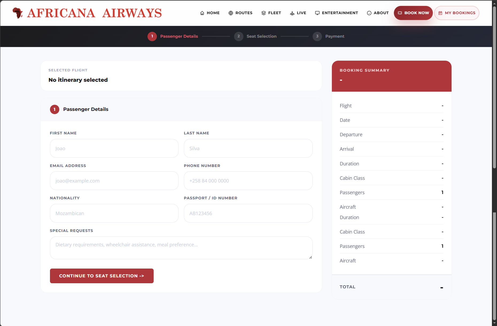
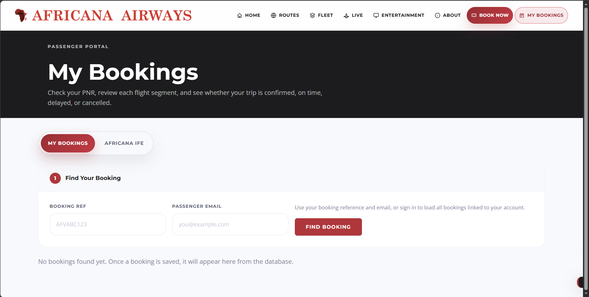

# Africana Virtual Airways

<p align="center">
  
</p>

<p align="center">
  
  
  
  
  
</p>

---

**Africana Virtual Airways** é uma plataforma web desenvolvida no âmbito da unidade curricular **Projeto de Desenvolvimento Web** da **Licenciatura em Engenharia Informática do IADE, Universidade Europeia**.

O projeto consiste no desenvolvimento de uma **web application completa para reserva de voos**, inspirada em plataformas reais de companhias aéreas como a Emirates ou a Lufthansa. O sistema permite aos utilizadores pesquisar voos, selecionar lugares, gerir reservas e explorar informação da companhia aérea através de uma interface moderna e interativa.

A plataforma simula o funcionamento de um **sistema digital de gestão de uma companhia aérea**, integrando frontend interativo, backend com lógica de negócio, APIs externas e ferramentas administrativas para gestão operacional.

O projeto segue a metodologia **Project-Based Learning (PBL)** e tem como objetivo aplicar conhecimentos de desenvolvimento web, arquitetura de sistemas, integração de APIs e design de interfaces centradas no utilizador.

---

## Índice

- [Objetivo do Projeto](#objetivo-do-projeto)
- [Stack Tecnológica](#stack-tecnológica)
- [Frontend](#frontend)
- [Backend](#backend)
- [Screenshots](#screenshots)
- [Quick Start](#quick-start)
- [Documentação](#documentação)
- [Equipa de Desenvolvimento](#equipa-de-desenvolvimento)
- [Licença](#licença)

---

## Objetivo do Projeto

O objetivo principal é desenvolver uma **plataforma web funcional para gestão e reserva de voos**, simulando os principais serviços digitais oferecidos por companhias aéreas modernas.

Entre os principais objetivos estão:

- Criar uma **interface intuitiva para pesquisa e reserva de voos**
- Implementar um **sistema de gestão de reservas (PNR)**
- Integrar **dados externos de aviação e meteorologia**
- Desenvolver **visualizações interativas de rotas e aeronaves**
- Construir um **backoffice administrativo para monitorização do sistema**
- Aplicar boas práticas de **UI/UX, segurança e arquitetura web**

---

## Stack Tecnológica

| Camada | Tecnologias |
|---|---|
| **Frontend** | HTML5, CSS3, JavaScript (ES6+), Leaflet, Chart.js, HTML5 Canvas |
| **Backend** | PHP 8.1 (sem framework) |
| **Base de Dados** | MySQL 8+ (PDO) |
| **Segurança** | JWT HS256 (implementação própria), bcrypt |
| **APIs Externas** | VATSIM, Aviation Weather (METAR), Alpha Vantage |
| **Ferramentas** | Servidor embutido do PHP, Apache (produção) |

---

## Frontend

O frontend da plataforma é responsável pela **experiência do utilizador**, disponibilizando várias interfaces interativas relacionadas com a operação da companhia aérea.

### Sistema de Reserva (Booking UI)

Interface de pesquisa de voos que permite ao utilizador selecionar origem, destino e datas de viagem, bem como preencher os dados dos passageiros para concluir a reserva.

### Mapa de Assentos Interativo

Representação visual da cabine da aeronave que permite ao utilizador selecionar lugares disponíveis em tempo real.

### Gestão de Reserva

Portal **"Minhas Viagens"** onde os utilizadores podem inserir a referência da reserva (PNR) e o email para consultar itinerários, detalhes do voo e estado da reserva.

### Rede de Destinos

Visualização das rotas operadas pela companhia num **mapa interativo** construído com **Leaflet**, em que cada ligação é desenhada como um arco de grande círculo entre os aeroportos.

### Galeria da Frota

Página responsiva dedicada à apresentação da frota da companhia aérea, organizada desde aeronaves regionais (por exemplo, **Embraer 190**) até aeronaves de longo curso (por exemplo, **Airbus A340-600**), incluindo especificações técnicas.

### In-Flight Entertainment (IFE)

Centro de entretenimento digital inspirado nos sistemas reais das companhias aéreas, incluindo:

- leitor de vídeo para conteúdos multimédia
- jogos baseados em browser desenvolvidos com **HTML5 Canvas**

### Live Flight Map

Mapa interativo, construído com **Leaflet**, que apresenta as aeronaves da companhia em movimento, permitindo acompanhar rotas e posições em tempo real através da rede **VATSIM**.

---

## Backend

O backend é responsável pela **lógica de negócio, gestão de dados e integração com serviços externos**.

### Motor de Reservas e Sistema PNR

Sistema responsável pela geração de **Passenger Name Records (PNR)** únicos e pela gestão das reservas efetuadas.

Funcionalidades principais:

- criação de reservas
- consulta de reservas com ou sem conta
- cancelamento de voos, com libertação automática dos lugares
- armazenamento em **base de dados relacional (MySQL)**

### Pesquisa de Voos e Pricing Dinâmico

Motor que pesquisa itinerários na rede de rotas, incluindo voos com escala, e calcula tarifas de forma dinâmica.

Inclui:

- pesquisa de itinerários em largura (BFS) sobre o grafo de rotas
- cálculo dinâmico de tarifas com base no preço do petróleo, sazonalidade e procura

### Integração VATSIM e Meteorologia

Integração com APIs externas para enriquecimento da informação de voo.

Inclui:

- consumo da **API VATSIM** para obtenção dos voos ativos da companhia
- cálculo dinâmico de **ETA (Estimated Time of Arrival)** e do progresso do voo
- integração com a **Aviation Weather (METAR)** para a meteorologia do destino

### Backoffice Administrativo

Painel administrativo restrito que permite monitorizar e gerir o funcionamento da plataforma.

Entre as funcionalidades:

- gestão de reservas, rotas, frota e utilizadores
- análise estatística descritiva e inferencial das reservas

### Segurança e Autenticação

Implementação de mecanismos de segurança para proteger o sistema.

Inclui:

- autenticação por JWT, com palavras-passe protegidas por bcrypt
- proteção de rotas sensíveis da API
- controlo de acesso ao painel administrativo

---

## Screenshots

| Homepage | Pesquisa de Voos |
|:---:|:---:|
|  |  |

| Reserva Dados do Passageiro | Portal My Bookings |
|:---:|:---:|
|  |  |

---

## Quick Start

**Pré-requisitos:** PHP 8.1+ e MySQL 8+. Não são necessárias dependências adicionais (sem Composer e sem npm).

```bash
# 1. Configurar ambiente
cp .env.example .env
# (editar .env com as credenciais da base de dados e o JWT_SECRET)

# 2. Correr a aplicação a partir da raiz do projeto
php -S localhost:3000 router.php
```

A aplicação fica disponível em `http://localhost:3000`. Na primeira execução, a base de dados, o schema e os dados de seed são criados automaticamente.

Guia detalhado de instalação: [`docs/instalacao.md`](docs/instalacao.md).

---

## Documentação

| Documento | Conteúdo |
|---|---|
| [`docs/arquitetura.md`](docs/arquitetura.md) | Arquitetura do sistema, fluxo de pedidos e bootstrap |
| [`docs/api.md`](docs/api.md) | Referência completa da REST API |
| [`docs/base-de-dados.md`](docs/base-de-dados.md) | Modelo de dados (10 tabelas) |
| [`docs/algoritmos.md`](docs/algoritmos.md) | Pesquisa de voos, pricing dinâmico e estatística |
| [`docs/instalacao.md`](docs/instalacao.md) | Instalação e execução |

---

## Equipa de Desenvolvimento

Projeto desenvolvido por:

**Tiago Manuel Antunes Cabaça**  
Número de aluno: 20241185

**César de Oliveira Rodrigues**  
Número de aluno: 20240449

**Muhammad Sudeis Abdul Latif Sacoor**  
Número de aluno: 20241707

Licenciatura em **Engenharia Informática**  
**IADE, Universidade Europeia**

---

## Licença

Este projeto é distribuído sob a licença **MIT**.

A licença MIT permite que o software seja utilizado, modificado e distribuído livremente, desde que seja mantido o aviso de copyright original e a referência à licença.

Para mais detalhes, consultar o ficheiro [`LICENSE`](LICENSE) presente neste repositório.
