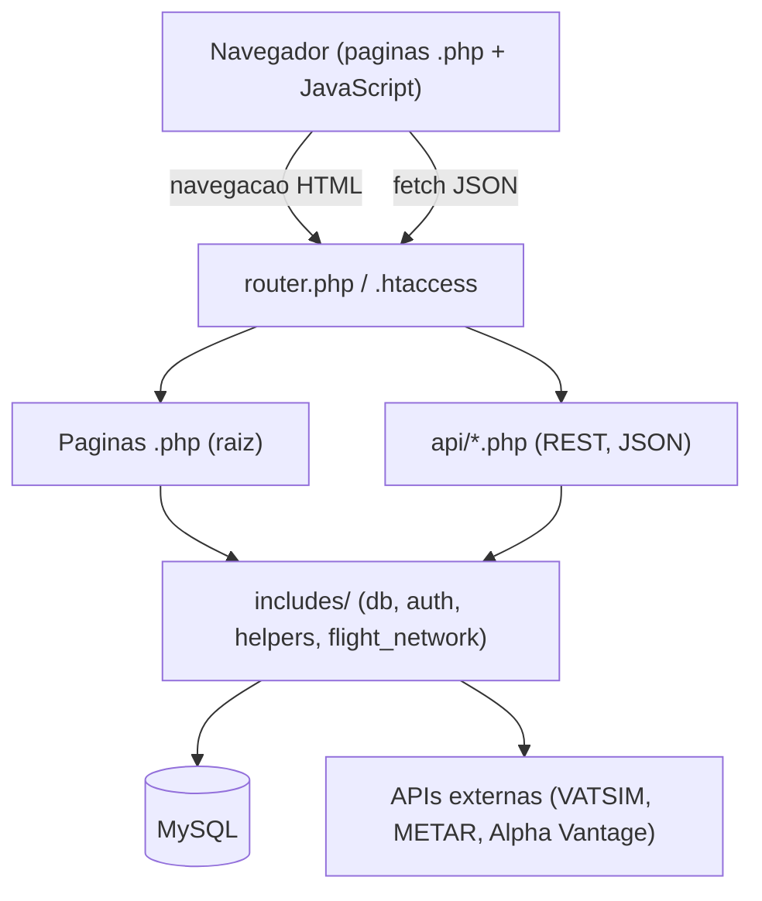

# Arquitetura do Sistema

A Africana Virtual Airways é uma aplicação web monolítica em PHP que, a partir de um único projeto, serve as páginas do site e uma API REST consumida pelo navegador. A aplicação não utiliza framework nem gestor de dependências.

## Visão geral

A solução organiza-se em três responsabilidades:

1. Páginas web renderizadas no servidor (ficheiros `.php` na raiz).
2. API REST em JSON (`api/*.php`), consumida pelo JavaScript do navegador.
3. Camada partilhada de lógica de negócio e acesso a dados (`includes/`).



## Stack tecnológica

| Camada | Tecnologia |
|---|---|
| Servidor | PHP 8.1+ (sem framework); servidor embutido do PHP em desenvolvimento, Apache ou Nginx em produção |
| Base de dados | MySQL 8 (InnoDB, `utf8mb4`), acesso via PDO |
| Autenticação | JWT HS256 (implementação própria em `includes/auth.php`); palavras-passe com bcrypt |
| Frontend | HTML, CSS e JavaScript vanilla (ES6+), sem framework |
| Visualizações | Leaflet (mapa de rotas e Live Flight Map, com arcos de grande círculo), Chart.js (gráficos do backoffice), HTML5 Canvas (jogos do IFE) |
| Integrações | VATSIM, Aviation Weather (METAR), Alpha Vantage (Brent crude) |

## Estrutura de pastas

```
/
  router.php              Router do servidor embutido do PHP (desenvolvimento)
  .htaccess               Routing equivalente para Apache (producao)
  index.php               Pagina inicial e motor de pesquisa
  search-results.php      Resultados de pesquisa de voos
  booking.php             Fluxo de reserva (dados, seat map, confirmacao)
  my-bookings.php         Portal "Minhas Viagens"
  fleet.php               Galeria da frota
  routes.php              Mapa de rotas
  vatsim.php              Live Flight Map
  ife.php                 In-Flight Entertainment
  about.php               Pagina institucional
  admin.php               Backoffice administrativo

  api/                    Endpoints REST (JSON)
    auth.php              register, login, me
    flights.php           search, routes, airports, itinerary, seat-map, pricing-factors
    bookings.php          criar, consultar e cancelar reservas
    fleet.php             CRUD de aeronaves
    admin.php             backoffice: stats, metrics, users, bookings, routes, fleet, airline-stats
    vatsim.php            online, stats
    health.php            verificacao de disponibilidade

  includes/               Logica partilhada (servidor)
    db.php                Ligacao PDO e bootstrap (schema, migracoes, seed)
    auth.php              JWT, CORS, helpers JSON, tratamento de erros
    helpers.php           Distancia, pricing, pesquisa de voos, itinerarios, mappers
    flight_network.php    Rede de rotas e horarios usados no seed

  assets/
    css/                  main, admin, booking, fleet, ife, accessibility
    js/                   main, admin, booking, my-bookings, vatsim, live-map,
                          route-map, ife, flappy-plane, angry-planes
    img/                  imagens e logotipos (inclui img/fleet/)
    audio/  video/        conteudos multimedia do sistema IFE

  data/                   Dados de seed
    aircraft.json         18 aeronaves (com seat maps por classe)
    airports.json         41 aeroportos

  database/
    mysql.sql             Schema (10 tabelas, idempotente)
    seed_demo.php         Geracao de dados de demonstracao

  docs/                   Documentacao tecnica
```

## Fluxo de pedidos

### Desenvolvimento

O comando `php -S localhost:3000 router.php` encaminha todos os pedidos para o `router.php`, que decide o destino:

1. Caminhos iniciados por `/api/<grupo>` incluem o ficheiro `api/<grupo>.php` correspondente.
2. Ficheiros estáticos existentes (não `.php`) são servidos com o `Content-Type` adequado.
3. Os restantes caminhos mapeiam `/<pagina>` para `<pagina>.php`.
4. Quando nada corresponde, o pedido recai sobre `index.php`.

### Produção

Em Apache, o `.htaccess` da raiz aplica regras equivalentes: encaminha cada grupo `api/<grupo>(/...)` para o respetivo script, serve ficheiros existentes, transforma `/<pagina>` em `<pagina>.php` e bloqueia o acesso HTTP direto a `includes/`, `data/` e `database/`.

### Padrão dos endpoints

Os ficheiros `api/*.php` seguem o mesmo padrão:

```php
require_once __DIR__ . '/../includes/db.php';
require_once __DIR__ . '/../includes/auth.php';
require_once __DIR__ . '/../includes/helpers.php';

cors_headers();                    // CORS, Content-Type JSON e resposta a OPTIONS
$method = $_SERVER['REQUEST_METHOD'];
$path   = api_path('/api/grupo');  // parte do caminho a seguir ao prefixo

// despacho por metodo e caminho, terminando em json_ok(...) ou json_err(...)
```

A autorização é declarada no início de cada handler: `require_auth()` exige um utilizador autenticado e `require_admin()` exige o papel `admin`. Os endpoints públicos não invocam nenhuma das duas.

## Camada partilhada

| Ficheiro | Responsabilidade |
|---|---|
| `db.php` | Carrega o `.env`, abre a ligação PDO (singleton `db()`), cria a base de dados se necessário, executa o schema, aplica migrações leves, faz backfill e popula os dados de seed. |
| `auth.php` | Assinatura e verificação de JWT HS256, `cors_headers()`, `json_ok()` e `json_err()`, `req_body()`, `require_auth()` e `require_admin()`, além do tratamento global de erros que converte exceções em JSON. |
| `helpers.php` | Distância (haversine), cálculo dinâmico de preços, pesquisa de itinerários, validação e hidratação de itinerários, geração de referência de reserva e conversão entre linhas da base de dados e objetos JSON. |
| `flight_network.php` | Rede de rotas (100 ligações entre dois hubs), horários base (07:00, 12:00 e 18:00) e estatísticas institucionais usados no seed inicial. |

## Bootstrap da base de dados

A ligação é obtida de forma lazy através da função `db()`. Na primeira invocação, a aplicação executa, por esta ordem:

1. Criação da base de dados (`CREATE DATABASE IF NOT EXISTS`).
2. Execução do schema a partir de `database/mysql.sql`.
3. Migrações leves de colunas e índices acrescentados posteriormente.
4. Backfill das tabelas filhas de reservas a partir de dados existentes, quando aplicável.
5. Criação ou elevação da conta de administrador principal, se as variáveis `PRIMARY_ADMIN_*` estiverem definidas.
6. Seed de aeronaves, imagens da frota, aeroportos, rotas, horários e estatísticas, caso as tabelas estejam vazias.

O processo é idempotente: arrancar com uma base de dados já populada não duplica dados.

## Integrações externas

| Serviço | Utilização | Cache |
|---|---|---|
| VATSIM (`data.vatsim.net`) | Pilotos online com indicativo `AFV` para o Live Flight Map | 60 segundos |
| Aviation Weather (`aviationweather.gov`) | METAR do aeroporto de destino, para enriquecer os voos VATSIM | 10 minutos |
| Alpha Vantage (`alphavantage.co`) | Preço do Brent crude para o multiplicador de combustível no pricing | 24 horas |

As três integrações degradam de forma controlada: sem rede ou sem chave de API, o sistema recorre a valores de fallback (por exemplo, petróleo a 80 USD por barril) e a restante plataforma mantém-se funcional.

## Segurança

* JWT HS256 assinado com `JWT_SECRET`, com validade de 24 horas, enviado no cabeçalho `Authorization: Bearer <token>`.
* Palavras-passe protegidas com `password_hash` (bcrypt, custo 10).
* Cinco níveis de acesso: público, opcional, autenticado, admin e admin principal (ver [`api.md`](api.md)).
* Os erros são sempre devolvidos como JSON, evitando a fuga de HTML ou de stack traces para o cliente.
* CORS permissivo em desenvolvimento e restringível por `CORS_ORIGIN` em produção.
* O `.htaccess` bloqueia o acesso HTTP direto a `includes/`, `data/` e `database/`.

## Documentos relacionados

* [`api.md`](api.md): referência completa da REST API.
* [`base-de-dados.md`](base-de-dados.md): modelo de dados.
* [`algoritmos.md`](algoritmos.md): pesquisa de voos, pricing dinâmico e estatística.
* [`instalacao.md`](instalacao.md): instalação e execução.
