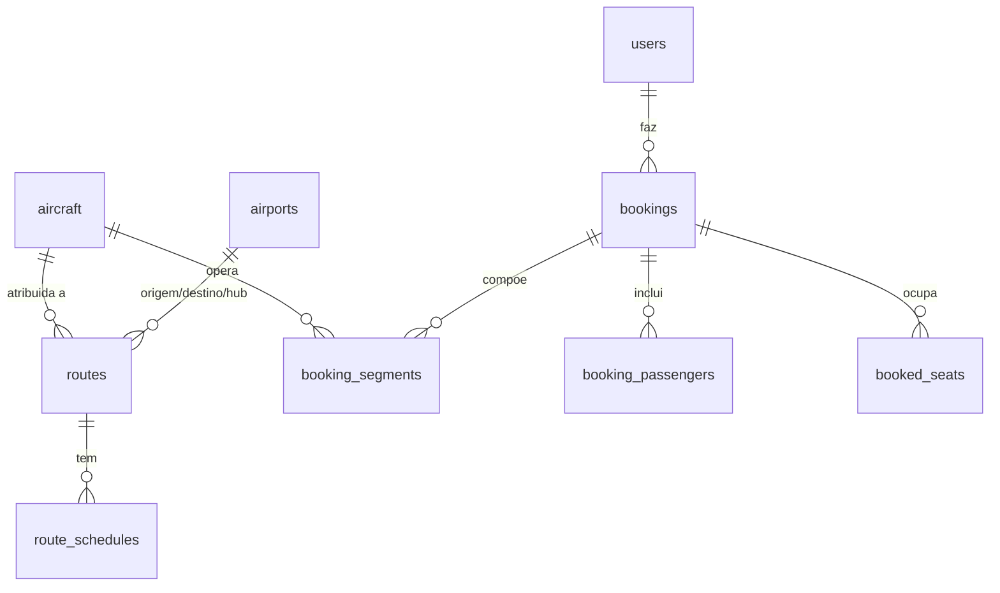

# Modelo de Dados

A plataforma utiliza MySQL 8 com charset `utf8mb4` e motor InnoDB, garantindo suporte a transações e integridade referencial. O schema completo e idempotente encontra-se em [`../database/mysql.sql`](../database/mysql.sql) e é executado automaticamente no arranque (ver [`arquitetura.md`](arquitetura.md#bootstrap-da-base-de-dados)).

O modelo tem 10 tabelas organizadas em torno da entidade central de reserva (`bookings`).

## Diagrama de relações

A tabela `airline_stats` mantém o perfil institucional da companhia e não tem relações.

## Tabelas

### users
Contas de utilizadores e administradores.

| Coluna | Tipo | Notas |
|---|---|---|
| `id` | INT PK AI | |
| `name` | VARCHAR(120) | |
| `email` | VARCHAR(160) | único |
| `password` | VARCHAR(255) | hash bcrypt |
| `vatsim_cid` | VARCHAR(32) | opcional |
| `role` | ENUM(`admin`,`user`) | predefinição `user` |
| `is_primary_admin` | TINYINT(1) | administrador principal |
| `created_by_user_id` | INT | conta que criou este utilizador |
| `joined_at` | DATETIME | |
| `flight_hours`, `points` | INT | dados de perfil |

### aircraft
Frota de aeronaves (18 no seed inicial).

| Coluna | Tipo | Notas |
|---|---|---|
| `id` | INT PK AI | |
| `registration` | VARCHAR(32) | matrícula, único |
| `type`, `category` | VARCHAR | por exemplo, `Airbus A340-600`, `Long Range` |
| `hub`, `hub_name` | VARCHAR | hub base (`FQMA` ou `DAAG`) |
| `economy_seats`, `business_seats`, `first_seats` | INT | lugares por classe |
| `range_km`, `cruise_speed_kmh` | INT | desempenho |
| `status` | VARCHAR | `active` ou `retired` |
| `image`, `description` | TEXT | |

Os detalhes do seat map por classe (filas e configuração) residem em [`../data/aircraft.json`](../data/aircraft.json) e são usados pelo endpoint `POST /api/flights/seat-map`.

### airports
Aeroportos da rede (41 no seed), indexados por código ICAO.

| Coluna | Tipo | Notas |
|---|---|---|
| `icao` | VARCHAR(8) PK | código ICAO |
| `iata` | VARCHAR(4) | opcional |
| `name`, `city`, `country` | VARCHAR | |
| `lat`, `lon` | DECIMAL(9,4) | coordenadas usadas nas visualizações geográficas e no cálculo de distâncias |
| `hub` | TINYINT(1) | identifica os hubs |

### routes
Ligações operacionais entre pares de aeroportos (100 no seed).

| Coluna | Tipo | Notas |
|---|---|---|
| `id` | INT PK AI | |
| `from_airport`, `to_airport`, `hub_airport` | VARCHAR(8) | códigos ICAO |
| `distance_km`, `duration_minutes` | INT | calculados por haversine |
| `aircraft_id` | INT FK para `aircraft` | `ON DELETE SET NULL` |
| `status` | VARCHAR | `active` ou `inactive` |

Restrição: `UNIQUE (from_airport, to_airport)`.

### route_schedules
Horários de cada rota (três slots por rota: 07:00, 12:00 e 18:00, num total de 300 no seed).

| Coluna | Tipo | Notas |
|---|---|---|
| `id` | INT PK AI | |
| `route_id` | INT FK para `routes` | `ON DELETE CASCADE` |
| `flight_number` | VARCHAR(16) | único (por exemplo, `AFV201`) |
| `slot_code` | VARCHAR(20) | `morning`, `midday` ou `evening` |
| `departure_time` | TIME | |
| `active` | TINYINT(1) | |

### bookings
Reserva, a entidade central. O itinerário e os passageiros são guardados em colunas JSON (snapshot do momento da compra) e também em tabelas filhas normalizadas, para consulta eficiente e robustez.

| Coluna | Tipo | Notas |
|---|---|---|
| `id` | INT PK AI | |
| `booking_ref` | VARCHAR(16) | referência PNR única (`AFV` mais 6 caracteres) |
| `user_id` | INT FK para `users` | `ON DELETE SET NULL`; nulo em reservas sem conta |
| `user_name`, `passenger_email` | VARCHAR | passageiro principal |
| `flight_number` | VARCHAR(64) | um ou vários (`AFV201 / AFV205`) |
| `from_airport`, `to_airport` | VARCHAR(8) | |
| `travel_date` | DATE | |
| `cabin_class` | ENUM(`economy`,`business`,`first`) | |
| `passengers` | INT | |
| `total_price` | DECIMAL(10,2) | |
| `status` | ENUM(`confirmed`,`on_time`,`delayed`,`cancelled`) | |
| `seat_selection` | VARCHAR(16) | lugar principal |
| `passenger_details`, `itinerary` | JSON | snapshot no momento da reserva |
| `created_at`, `updated_at`, `cancelled_at` | DATETIME | |

Índices por utilizador, data, estado e `(booking_ref, passenger_email)` para a consulta sem conta.

### booking_passengers
Um registo por passageiro numa reserva com vários passageiros.

| Coluna | Tipo | Notas |
|---|---|---|
| `id` | INT PK AI | |
| `booking_id` | INT FK para `bookings` | `ON DELETE CASCADE` |
| `passenger_index` | INT | `UNIQUE (booking_id, passenger_index)` |
| `first_name`, `last_name`, `email` | VARCHAR | |
| `phone`, `nationality`, `seat_selection` | VARCHAR | opcionais |

### booking_segments
Cada perna de voo de uma reserva, incluindo escalas.

| Coluna | Tipo | Notas |
|---|---|---|
| `id` | INT PK AI | |
| `booking_id` | INT FK para `bookings` | `ON DELETE CASCADE` |
| `segment_index` | INT | `UNIQUE (booking_id, segment_index)` |
| `route_id` | INT | |
| `flight_number`, `from_airport`, `to_airport` | VARCHAR | |
| `departure_date`, `arrival_date`, horas e datetimes | DATE, VARCHAR, DATETIME | |
| `duration_minutes`, `distance_km` | INT | |
| `aircraft_id` | INT FK para `aircraft` | `ON DELETE SET NULL` |
| `aircraft_registration`, `aircraft_type` | VARCHAR | snapshot |

### booked_seats
Ocupação de lugares, que impede a venda do mesmo lugar duas vezes.

| Coluna | Tipo | Notas |
|---|---|---|
| `id` | INT PK AI | |
| `flight_number`, `departure_date`, `seat_id` | VARCHAR, DATE, VARCHAR | `UNIQUE (flight_number, departure_date, seat_id)` |
| `cabin_class` | ENUM | |
| `booking_ref` | VARCHAR(16) FK para `bookings.booking_ref` | `ON DELETE CASCADE` |

O cancelamento de uma reserva, pelo utilizador ou pelo administrador, liberta automaticamente os lugares ao eliminar as linhas correspondentes.

### airline_stats
Tabela de linha única com o perfil institucional da companhia (total de voos, horas, membros, data de fundação, primeiro voo, divisão VATSIM e prefixo de indicativo). Alimenta a página institucional e o backoffice.

## Decisões de desenho

* Snapshot e normalização: as colunas JSON `itinerary` e `passenger_details` preservam o estado exato no momento da compra, enquanto as tabelas filhas permitem consultas e estatísticas eficientes.
* Integridade referencial: a remoção de aeronaves não destrói rotas nem segmentos (`SET NULL`); a remoção de reservas propaga-se às tabelas filhas (`CASCADE`).
* Reservas sem conta: `user_id` é opcional e a consulta faz-se por `booking_ref` mais `email`.
* Dados geográficos: as coordenadas em `airports` são a base do mapa de rotas e do Live Flight Map.
